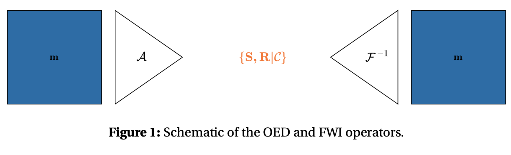
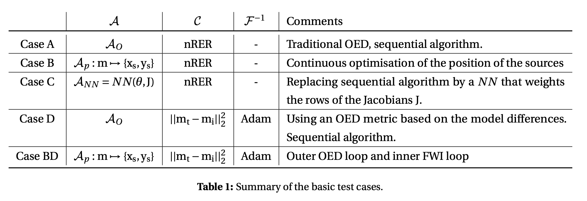

# Hybrid-OED

Exploring the possibility of combining OED and differentiable physics to design better inverse problems. The idea is to relax the OED problem from a combinatorial formulation to  a differentiable formulation. The key idea/motivation is to optimise the position of the sources and receivers continuously, not only in a single selection of the best sources and receivers at the begining of the survey.

The OED and FWI problems can be summarized in Figure 1. The OED process can be defined as by an operator $\mathcal{A:\ } \rm{m} \mapsto \{\rm{S,R}\}$ that maps a model $\rm{m}$ to a subset of sources and receivers $\{\rm{S, R}\}$. This operator is traditionally implemented as a sequential algorithm ($\mathcal{A}_{O}$) selecting the source/receiver maximising an OED criterion $\mathcal{C}$ from a comprehensive survey.

We  define a few test case that integrates more and more this idea of differentiablity. The following test case are defined from the different operators above.

Please refer to the `hybrid_OED_proposal_lab_book.pdf` to get the full oveview and description of all the test case.

##  Repo map

A few of the main functions are integrated into the `src/hybridoed` repository. Then a single notebook for each test case can be ran. The notebook `test_case_comparison` compile the results for each test case.

Some external file might be needed from the eegdevtest machine.

This repo is a work in progress and doesnt respect any good coding pratices...yet.

## Integration test

The sequential integration test must be ran locally because of difference in the JAX isntallation between local machine and CI machine.

## Benchmark of J-wave Helmholtz solver

[Benchmark-problems-for-transcranial-ultrasound](https://doi.org/10.1121/10.0013426)
